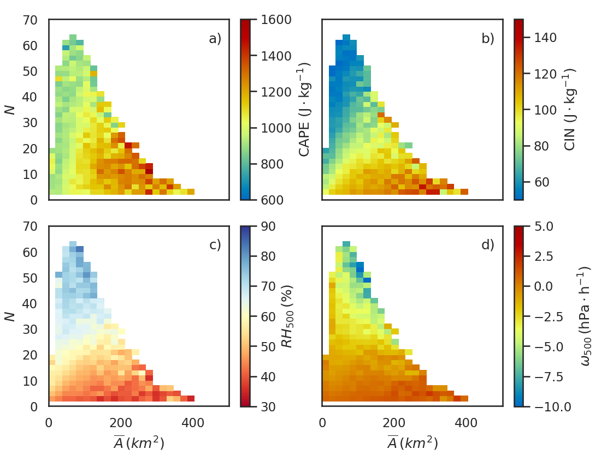

# phasespace
A phase-space diagram is a way in which all possible states of a system are represented.
It's an abstract space where the coordinates are the variables of the system.
For example:

This figure was made using this package and is part of the publication:
Louf, V., Jakob, C., Protat, A., Bergmann, M., & Narsey, S. (2019). The relationship of cloud number and size with their large‐scale environment in deep tropical convection. Geophysical Research Letters, 2019GL083964. [10.1029/2019GL083964]

## Requirements

This package requires numpy and a working fortran compiler.
